# CNCF End User Community Survey 2019 Results

This survey was conducted with the [CNCF End User Community](https://www.cncf.io/people/end-user-community/) between September 4-13th, 2019.

The goal was to look at the programs and ensure they meet the needs of the End User Community for 2020.

The results are also [available on Google Slides](https://docs.google.com/presentation/d/13s0X8GiCLCb0udqk7Mnm0459jsJayV0e0hLVJiq2SYc/edit?ts=5d810b63#slide=id.g60b1a45032_0_0).

# Summary

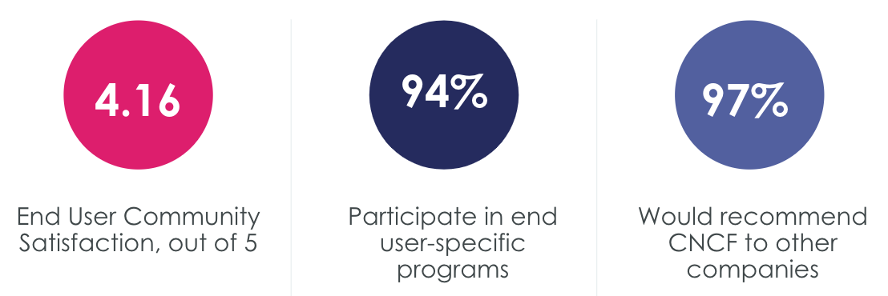

> * Great way to learn and share info with other end users
> * Healthy community that facilitates sharing of real-world experience. KubeCon/CloudNativeCon tickets. Dev Exp calls. Marketing opportunities.
> * Neutral home for open source project, get more relationship with community and maintainers
> * It's great to see what others are doing and how they are solving problems with technologies available.
> * It allows us to share information and experience regarding Kubernetes and other components deployment.
> * Assuming the org is willing to invest their team to work upstream via the SIGs their company can be invested in the platform and not just a suppliers dialect of the projects. It provides broad knowledge that helps us work with our partners and peers more effectively.
> * Being part of a community that are actually using these technologies in production at large scale is very useful, often meetups/conferences have a much broader set of people, many of which are only just starting out looking at these technologies

## Takeaways and action items

Overall high satisfaction with CNCF End User Community (4.16 / 5.0)
* 97% would recommend to other companies.
* Most valuable part of membership is networking with peers and KubeCon + CloudNativeCon.

Communication can improve (3.68 / 5.0)
* **Action Item:** Member desk launching soon to provide a single point to access CNCF services.

More localized events and services
* **Action Item:** CNCF will run Kubernetes Forums for local events.
* **Action Item:** Kubernetes Community Days are planned.
* **Action Item:** China-friendly meetings and tools

Even more end user representation
* 79% want to connect to projects and provide feedback
* **Action Item:** Add “Meet the maintainers” panel to End User Partner Summit at KubeCon + CloudNativeCon San Diego
* 39% want to provide direct feedback to the TOC
> * “Increase more end user case studies in Kubecon. Have more end user participation in Kubecon activities”
> * “Encourage and support End User Community initiated open source projects”
> * “CNCF GB and TOC are heavily dominated by vendor companies. It may be beneficial to the ecosystem to have more End User representation. “

# All results

### Q1 What is your geographic location?

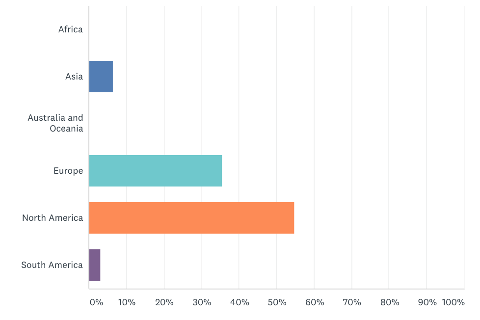

### Q2 How long have you been a member?

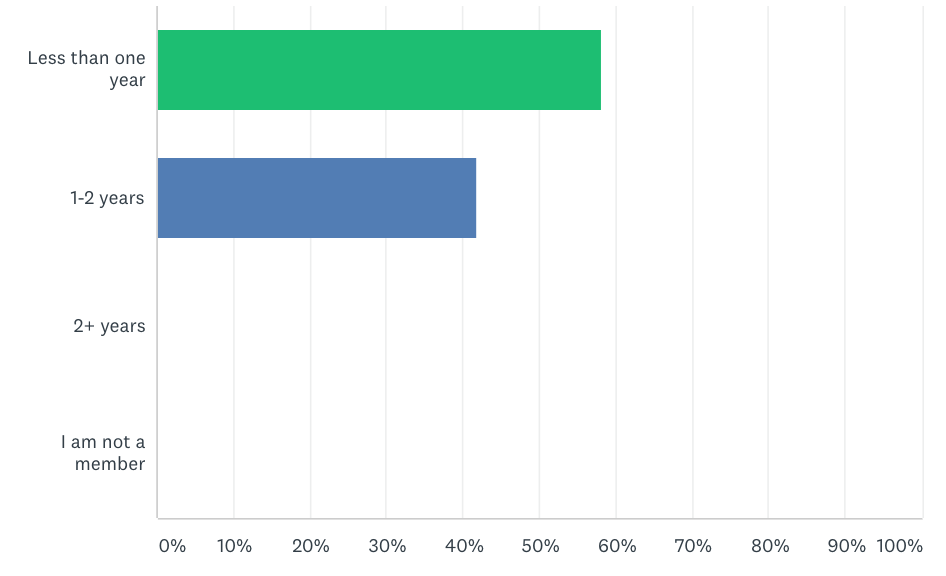

### Q3 How many employees does your company have?

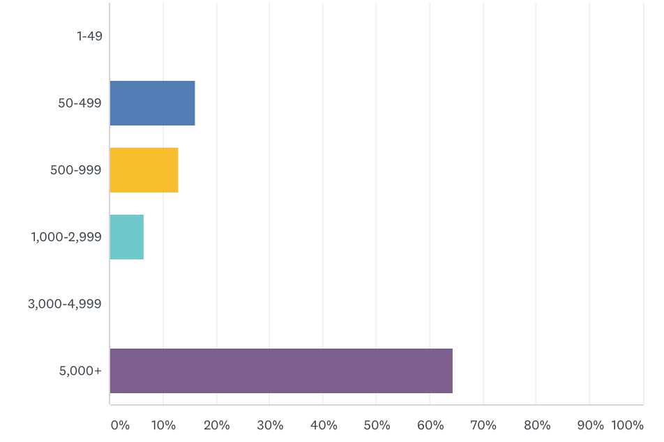

### Q4 Please confirm your CNCF level:

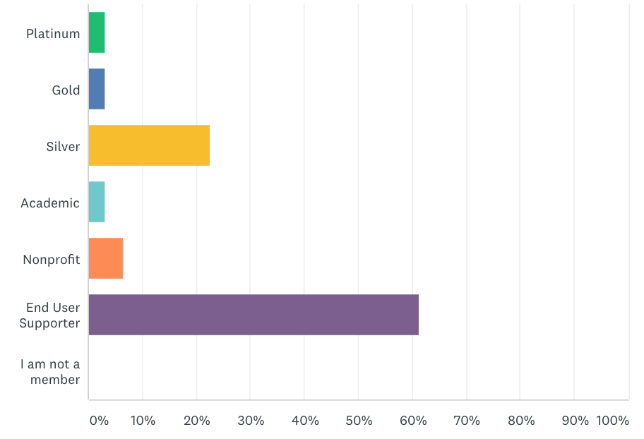

### Q5 What end user activities / programs through CNCF do you participate in?

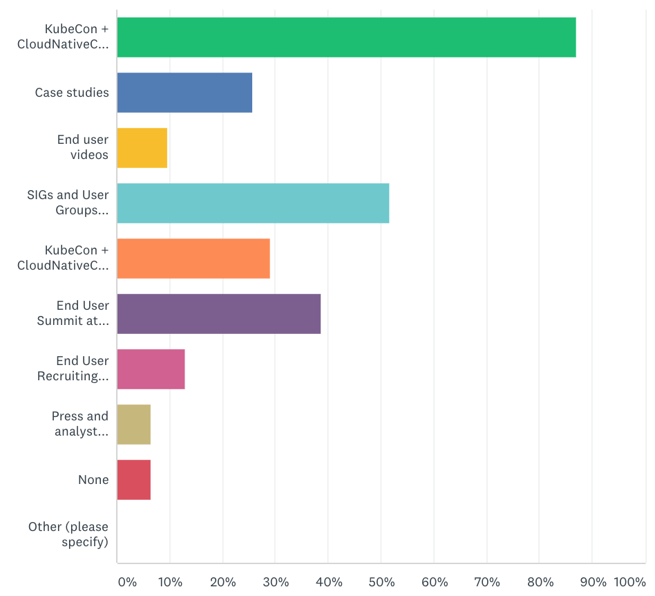

### Q6 What CNCF marketing programs do you participate in?

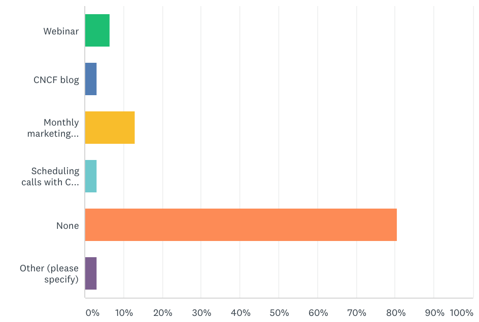

### Q7 How well did CNCF communicate the process to get involved in the activities and programs offered?

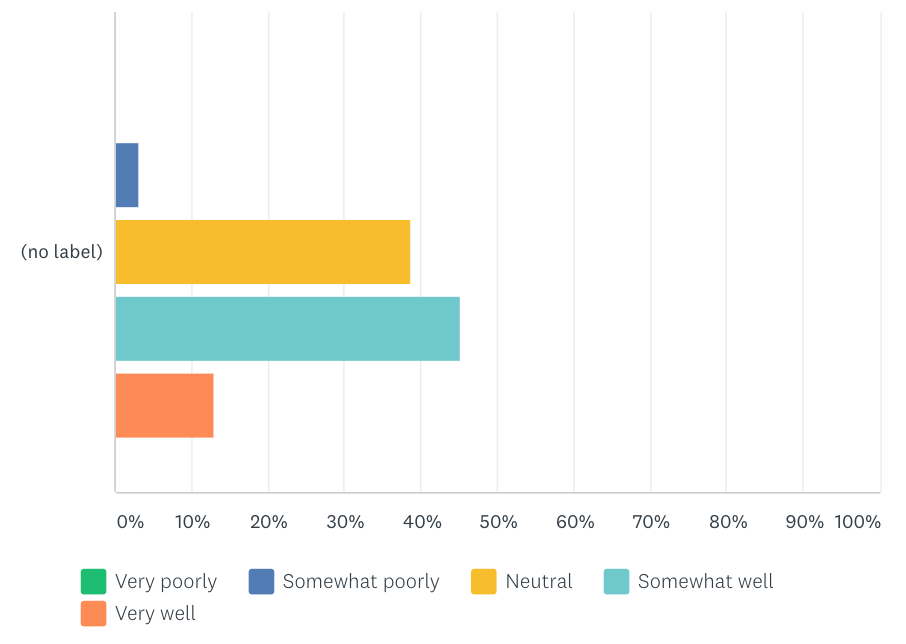

### Q8 What new programs would you participate in?

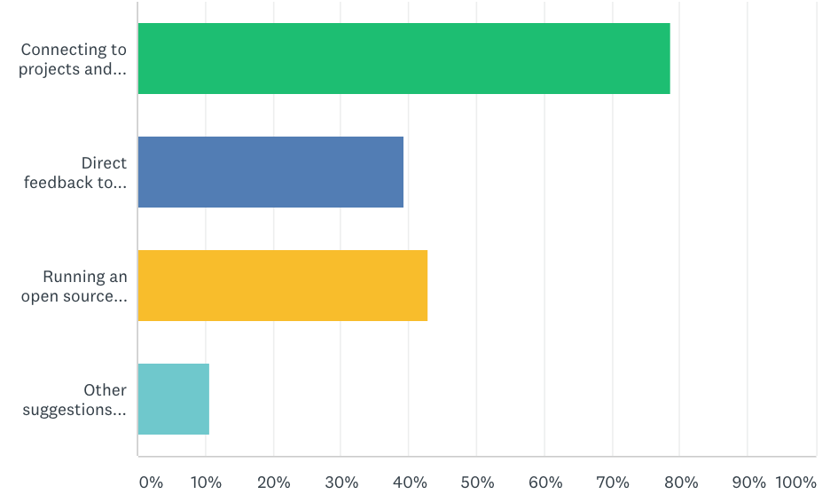

* Connecting to projects and providing feedback
* Direct feedback to Technical Oversight Committee
* Running an open source office
* Other suggestions (please specify)

Other suggestions:

> * I will donate a open source project ChubaoFS to CNCF sandbox, and I will keep on contribute to this project and also responsible for the project's promotion and marketing
> * End User Navigator: provide a list of proven combinations of tools used by real companies in production to help others to adopt the cloud native ecosystem in a proven path

### Q9 How did you hear about the CNCF End User Community?

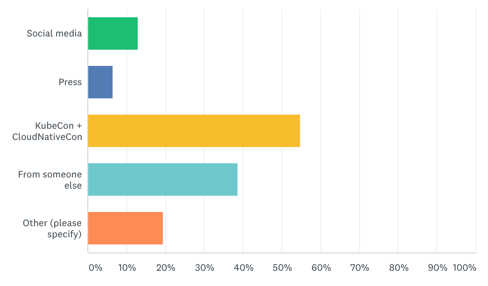

### Q10 What have you found to be the most valuable part of your CNCF Membership?

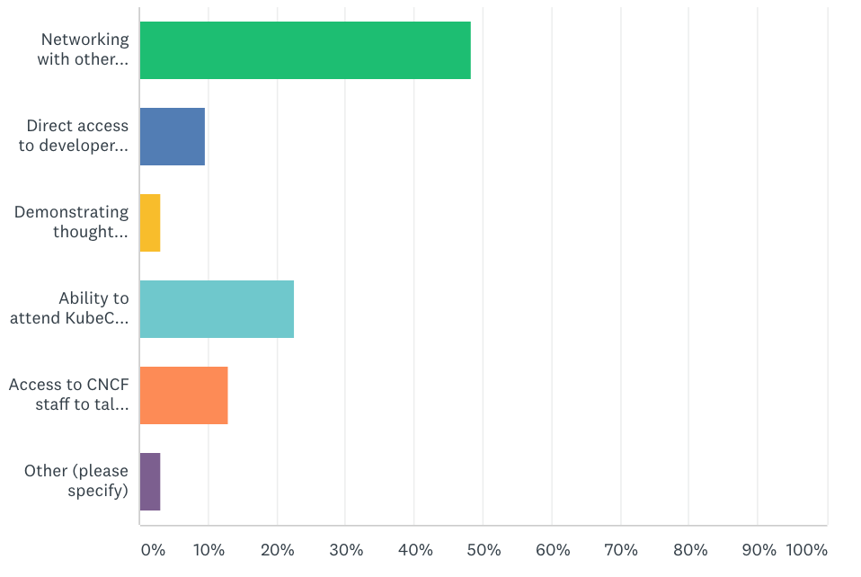

* Networking with other companies in the space
* Direct access to developers and maintainers in the community to or hire talent
* Demonstrating thought leadership in an emerging market
* Ability to attend KubeCon + CloudNativeCon and meet with other end users face to face
* Access to CNCF staff to talk about market trends, technologies, projects

### Q11 Have you taken advantage of networking opportunities with other CNCF members?

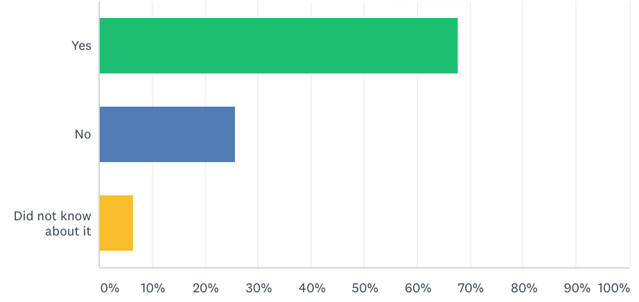

### Q12 What could CNCF do to get you more involved with your peers?

> * Increase more end user case studies in Kubecon. Have more end user participation in Kubecon activities
> * I think you must focus on developers instead of managers. It's important to make mandatory for new participants to indicate the developer's leaders/supporters. The content is too technical to managers follow. My suggestion would be demand the tech leads in the renew process (and the must the technical, others is ok but they must be mandatory).
> * Encourage and support End User Community initiated open source projects
> * More local (per continent) in-person meetings
> * Communicate the sign-up process better and make it more clear that a you don't have to be a fully Linux foundation member to get involved
> * Need some time and perhaps some help understanding how things work and who people are.
> * Organize "local" (e.g. Europe, not only meetups but central gatherings beyond kubecon) groups where we can exchange on certain topics
more opportunity to know tech friends and learn each other
> * Hard to say. I want the end-user companies to collaborate, but most of the people who attend the calls are already busy with a lot of their plate.
> * Have sessions on "How do you do..." where companies show and tell their methods for doing things. ie: How do you do image baking? How do you secure your containers? How do you manage kubernetes clusters at scale? How do you onboard new developers into your organization? Companies get 3 slides and 5 minutes to tell their story and have to sign up ahead of time to demo.
> * Help to bridge collaboration gaps between enterprises and commercial providers to work upstream and with each other following open principles rather than like "shrinkwrap". May be a collab effort w TODO.

### Q13 Has the CNCF membership experience met your expectations?

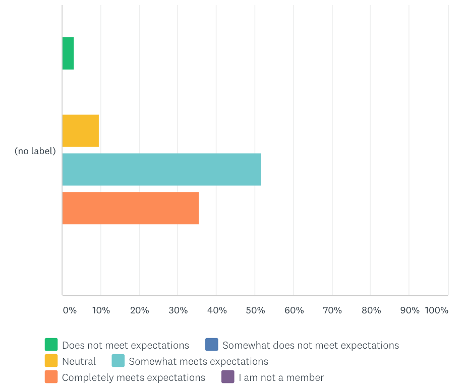

### Q14 Would you recommend CNCF membership to other companies?

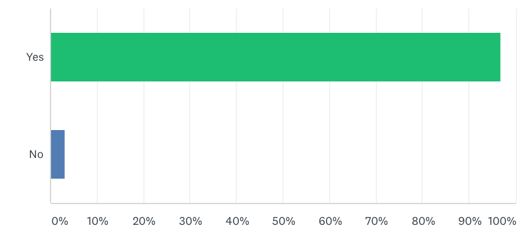

### Q15 Any other feedback that you wish to share? What can CNCF do more of or less of? How can CNCF help you in the next 6 months?

> * The developers here usually aren't involved as we expected, and my feeling is CNCF is too much manager involved - maybe because of the need for investment in projects, events, etc, and you don't know how far you are from the devs. My suggestion would be demand the tech leads in the renew process (mandatory)
CNCF GB and TOC are heavily dominated by vendor companies. It may be beneficial to the ecosystem to have more End User representation.
> * Would love more data and experience based analysis of how end-user membership benefits companies who join in terms of return on investment - e.g. How has it affected recruitment, operation and understanding of CNCF products? How has the end-user community calls improved understanding of the ecosystem, and has it helped operators make direct improvements to their platform?
> * I think CNCF can do more in end user internal contacts and relationship, and have more focus on China end user. The regular end user meeting time hard for chinese end user to attend. If you hope involve more Chinese end user, need give a convenient time for them get in touch.
> * Youtube video on cncf site walking organizations through some best practices for contributing to open source projects and starting an open source office initiative.
