# CNCF End User Community Survey 2020 Results

This survey was conducted with the [CNCF End User Community](https://www.cncf.io/people/end-user-community/) between August 10-21, 2019.

The goal was to look at the programs and ensure they meet the needs of the End User Community for 2021.

## Overall satisfaction is high and up from 2019

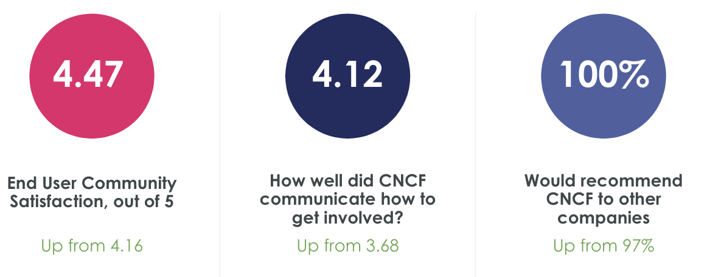

* Keep on doing that things already in progress. End-user calls are great and the tech radar is very useful.
* I think the CNCF End User community is already pretty great, some match-making and structure (such as Tech Radar) can help leverage it even more
* Keep the enduser meetings going!
* Love the idea and amount of contribution.
* I enjoy hearing other organizations discuss their experience implementing different flavors of the open source projects/software products. As we begin to mature our K8s offering, those conversations are very beneficial.
continue connecting end users and advocating for knowledge sharing and collaboration
* I think you're doing a great job.

## Even better with more localization and more structured activities

* Personally the timezone difference between Europe and US is an issue
* improve timing of meetings for EU users :-)
* Local / online meets outside of business hours 
* more local meetups
* Maybe more experience sharing - what worked, what didn't, what are folks using/not?
* Share opportunities where we can contribute
* More organized activities and/or round-table discussions
* Perhaps an end user specific event that does not collide with the main conference
* I dont think its a CNCF block, it’s a company block. It could be education to companies as to why this is important for not only the CNCF, but companies and individual growth of knowledge and experience.
* As an end user, I would like to see more reports on project adoption and case studies

# All results

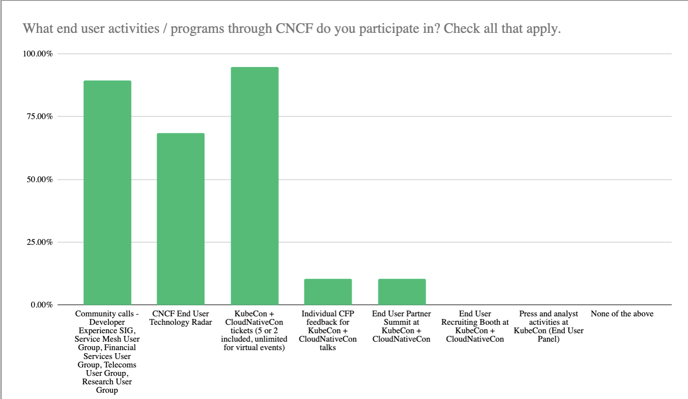

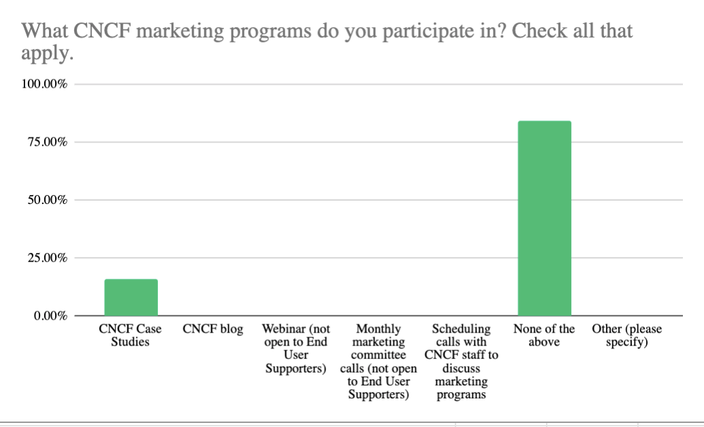

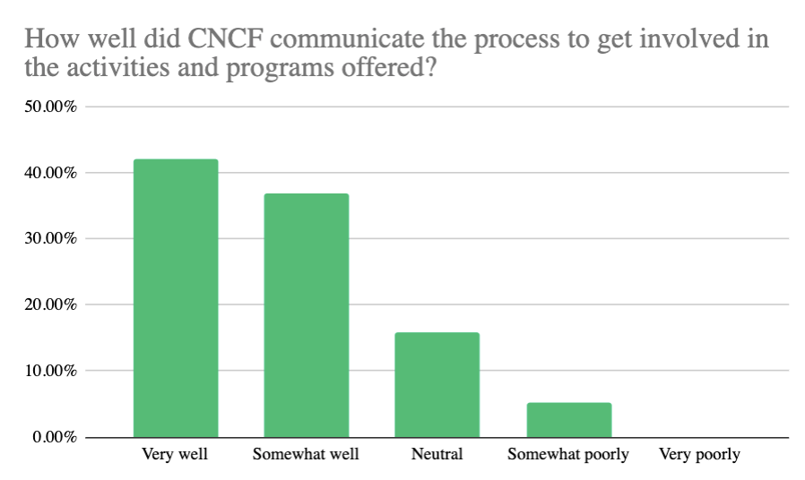

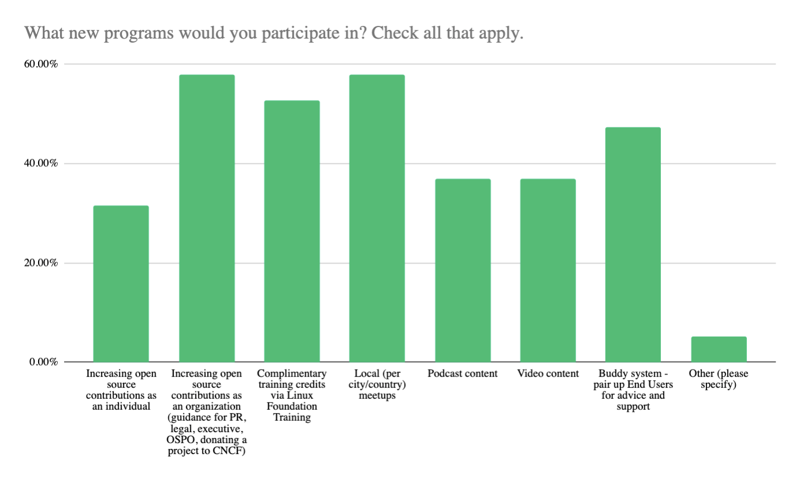

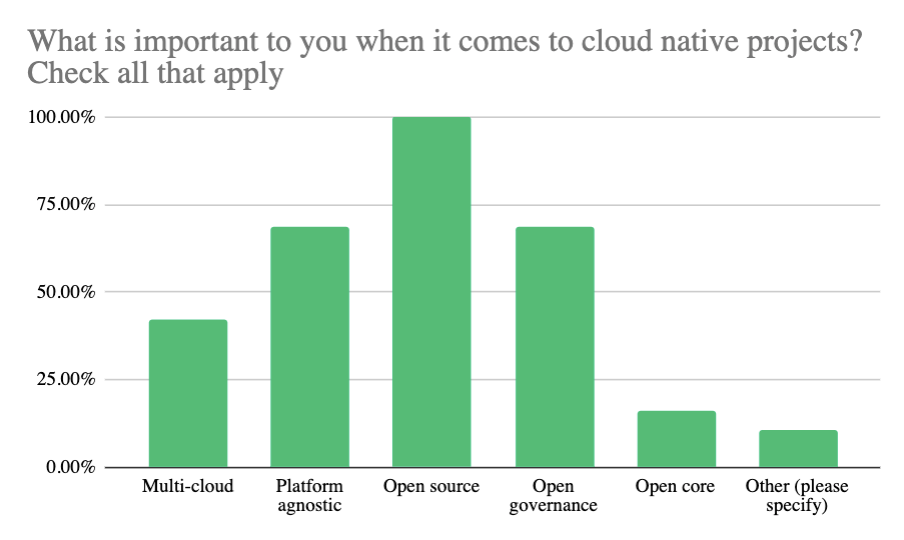

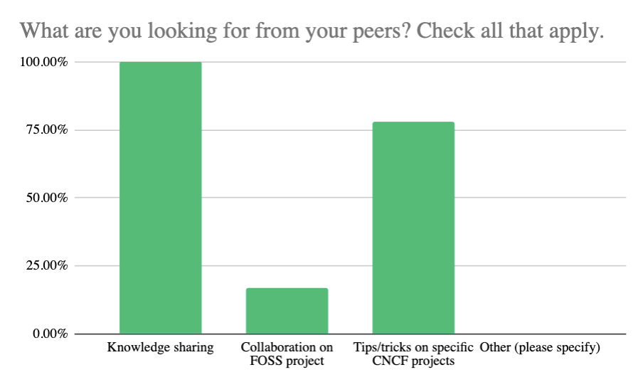

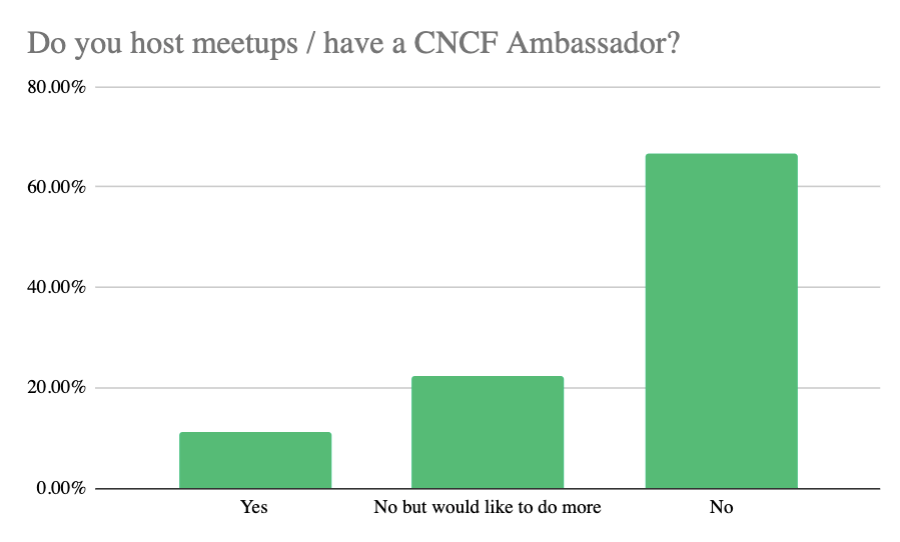

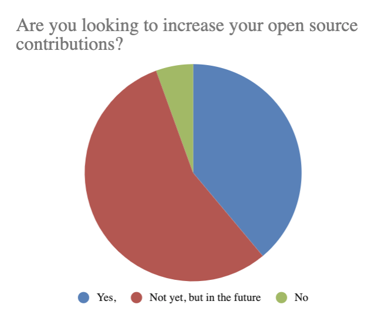

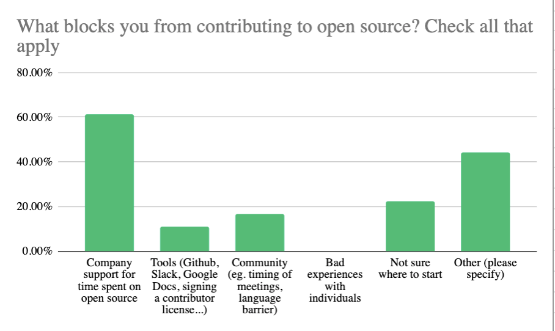

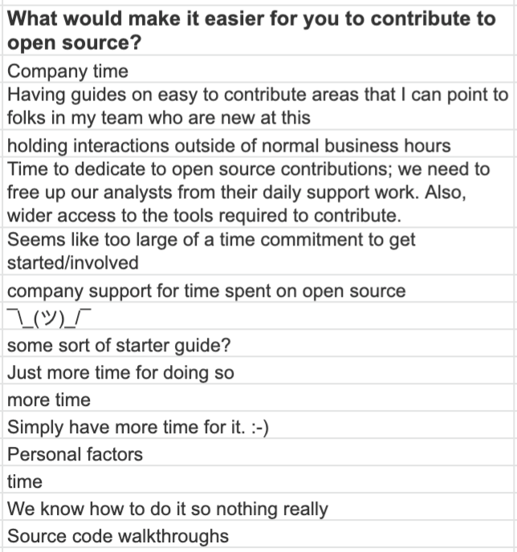

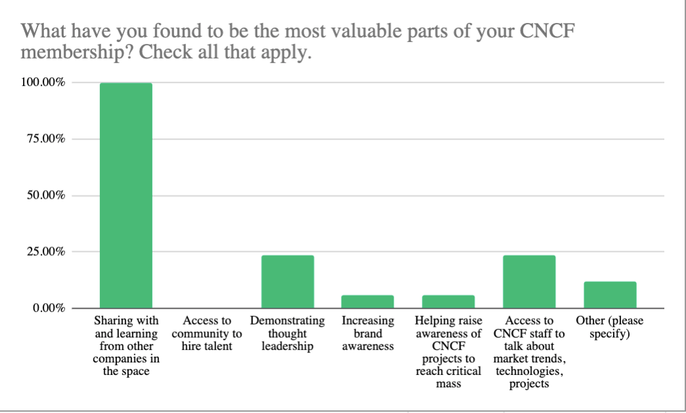

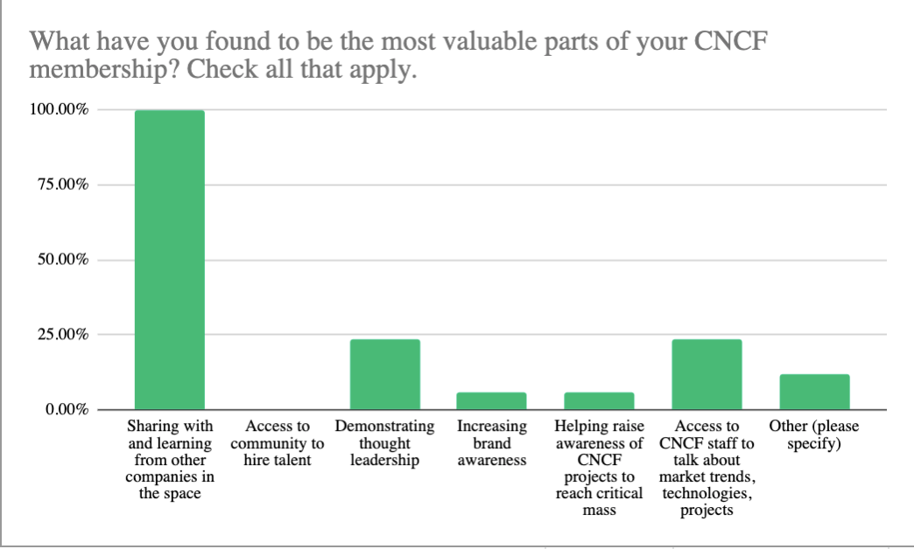
