# CNCF End User Community Survey 2022 Results

This survey was conducted with the [CNCF End User Community](https://www.cncf.io/enduser) between September 29 - October 21, 2022.

The goal was to look at the programs and ensure they meet the needs of the End User Community for 2023.

The results are also [available on Google Slides](https://docs.google.com/presentation/d/1gwbwvhRK1eIcK99km94S_ry09llCERXLfMBbPHTpE7A/edit?usp=sharing)

## End User Community Survey

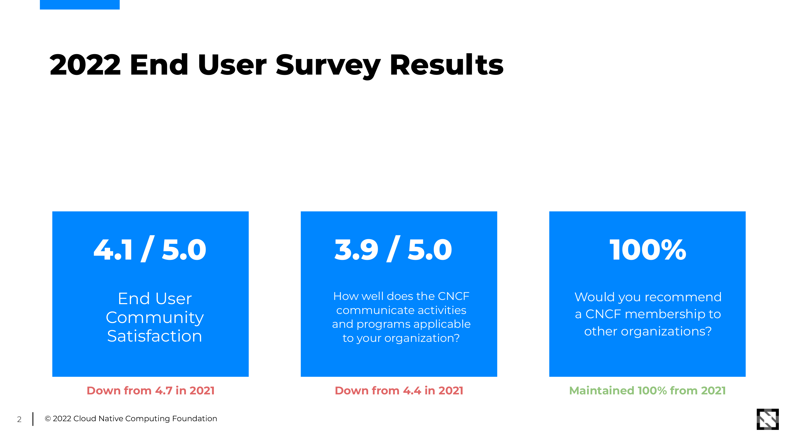

### Takeaways and action items

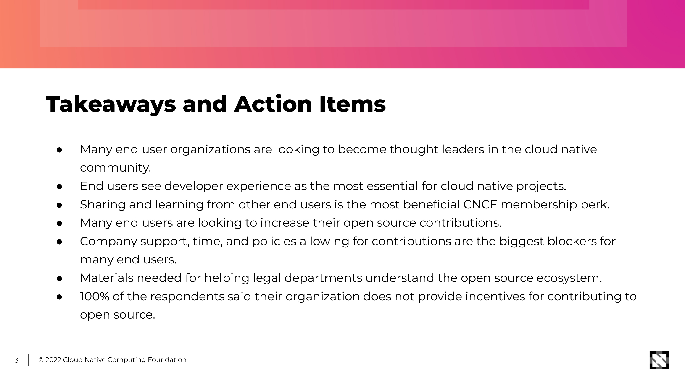

### Results

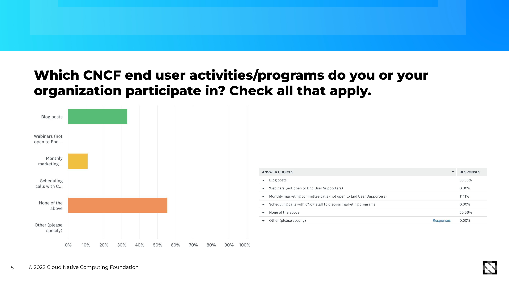

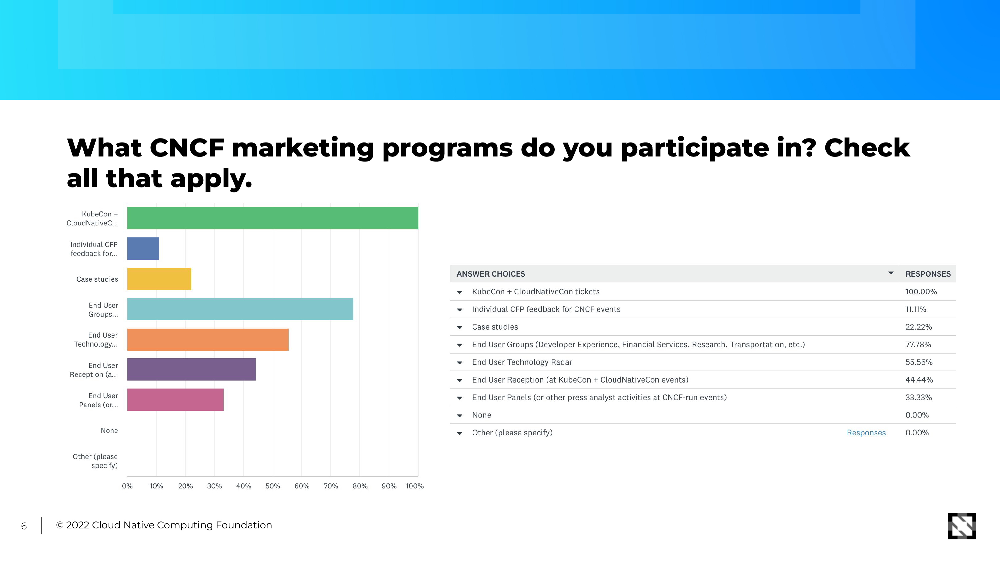

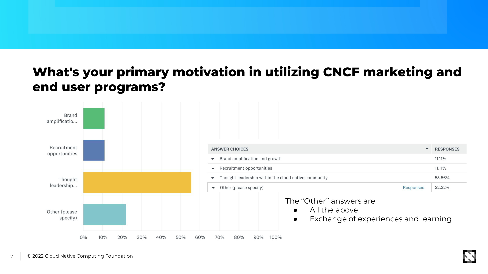

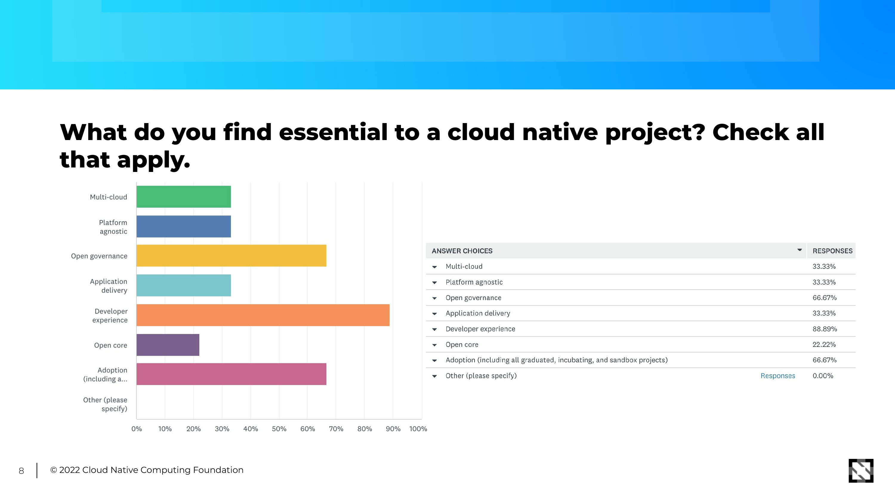

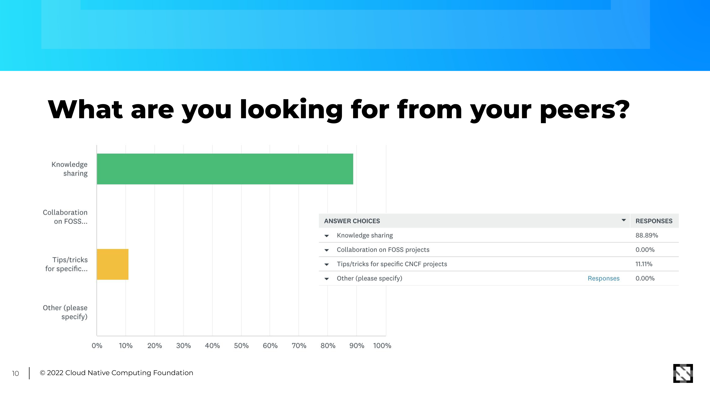

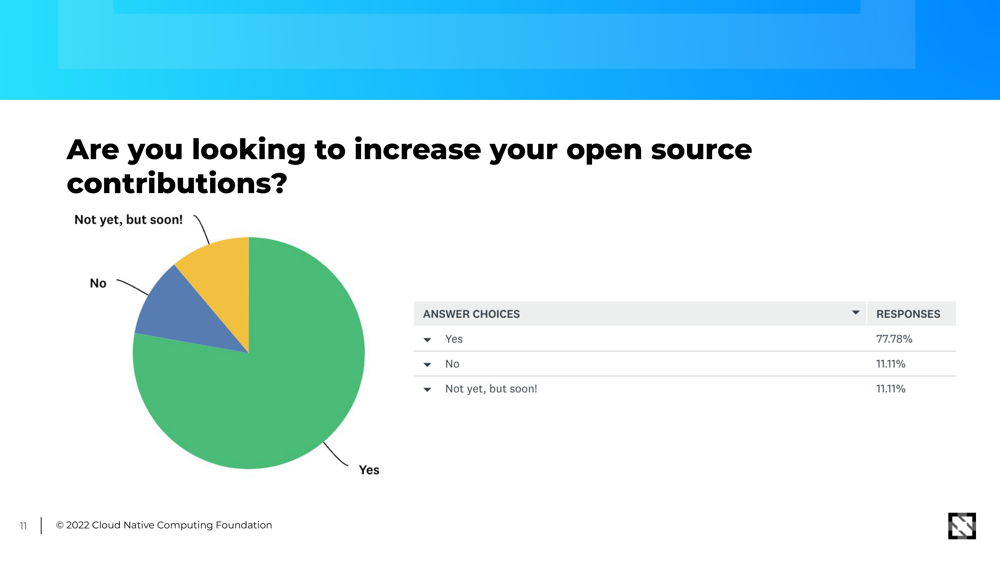

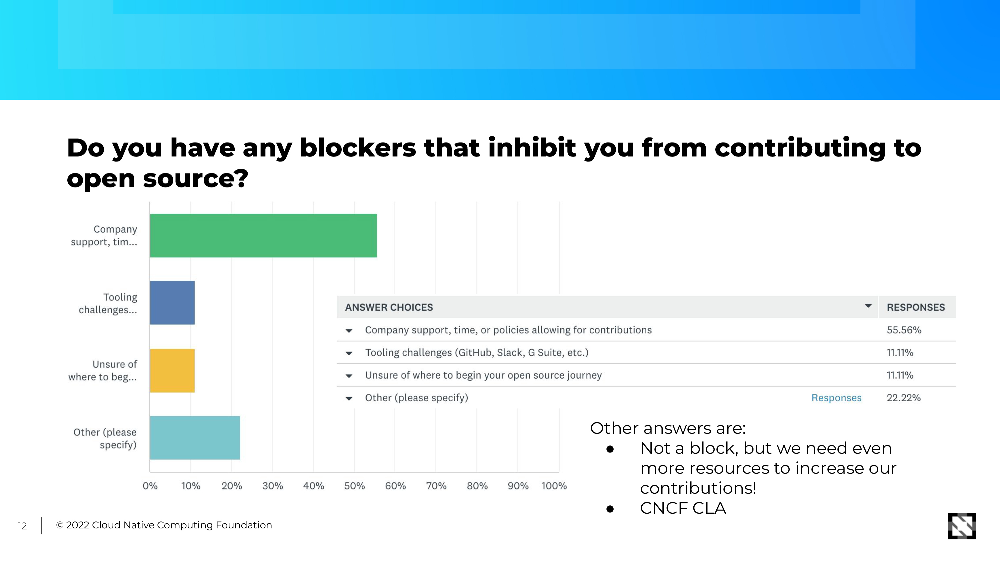

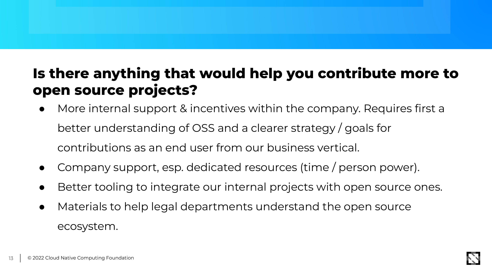

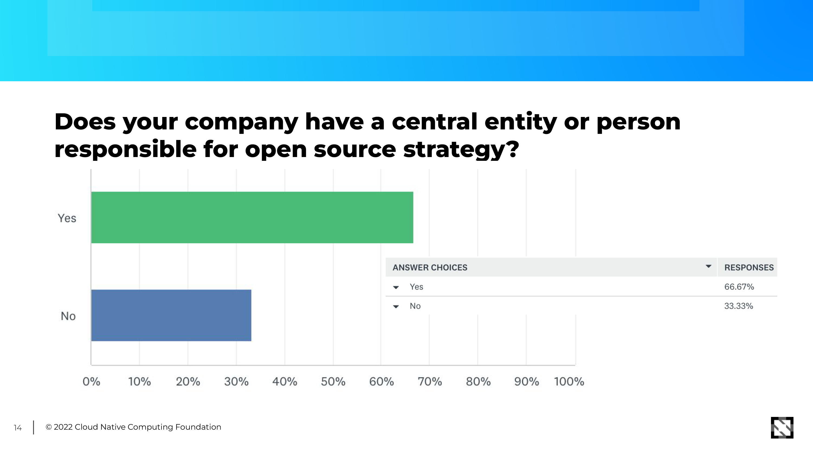

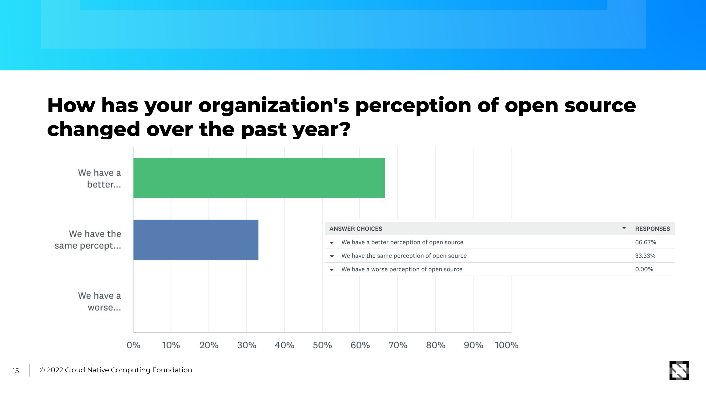

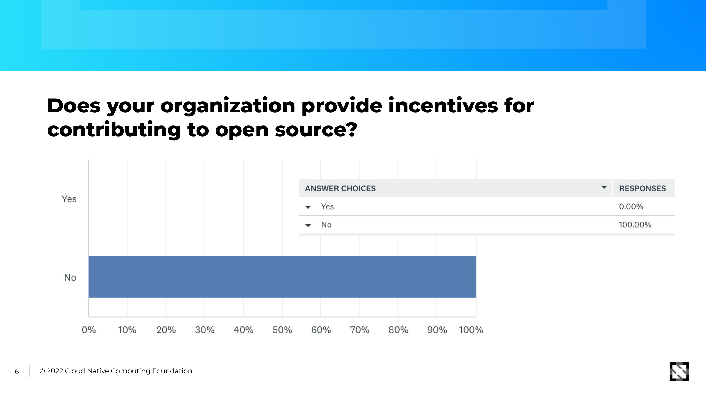

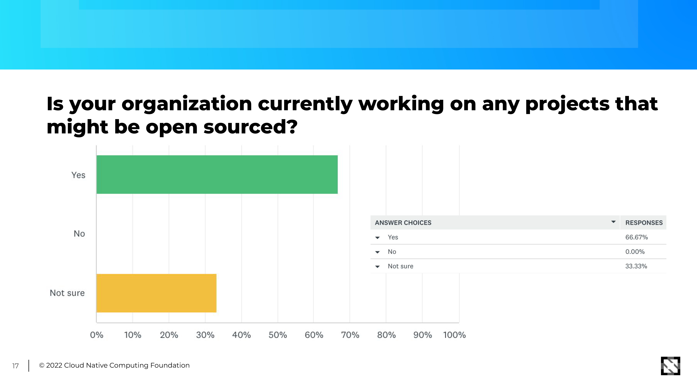

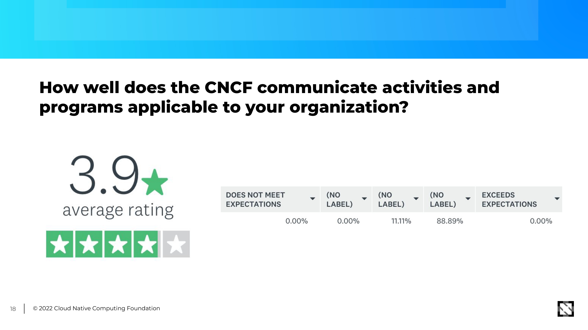

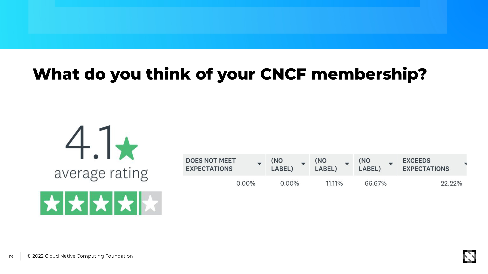

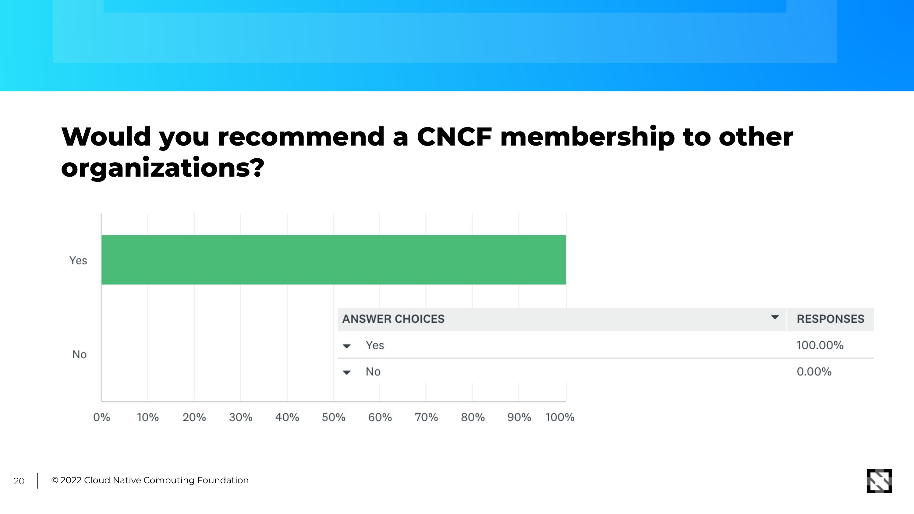

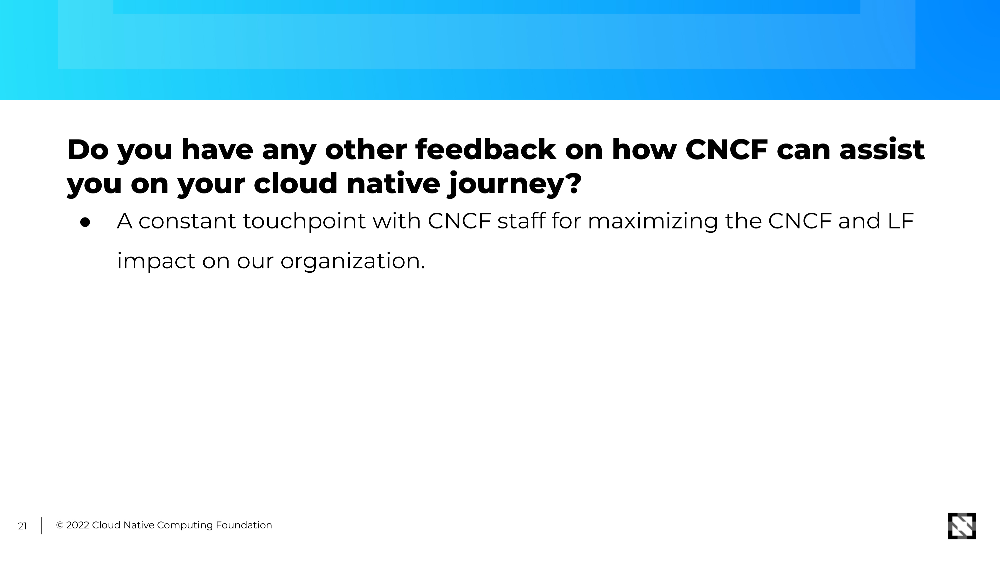
