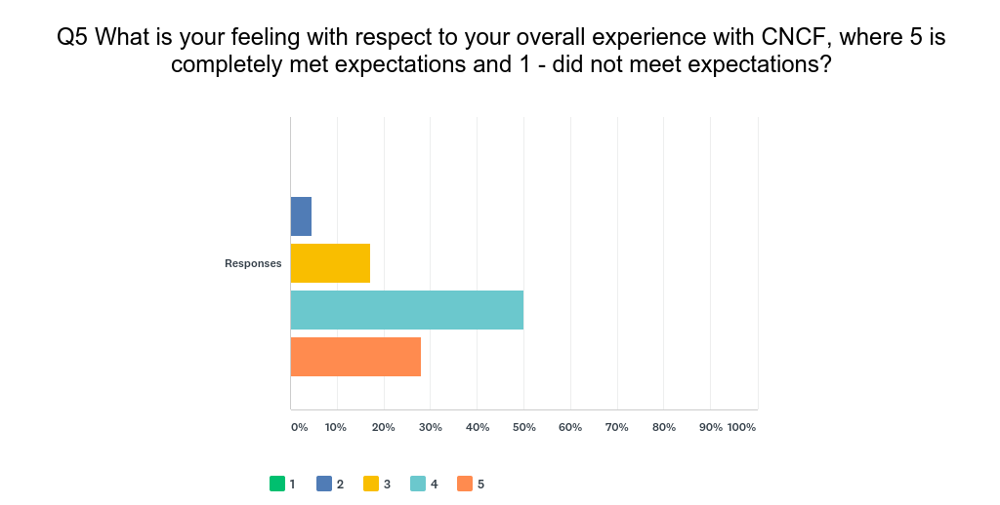
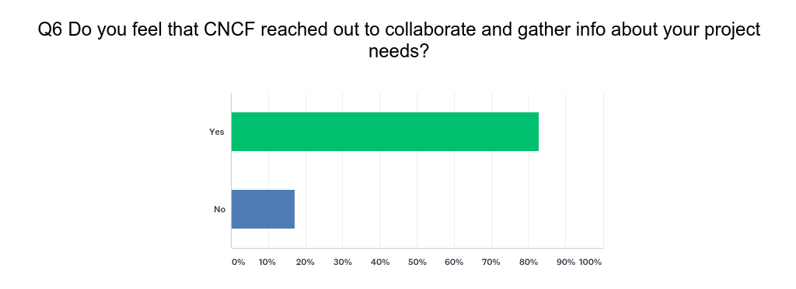
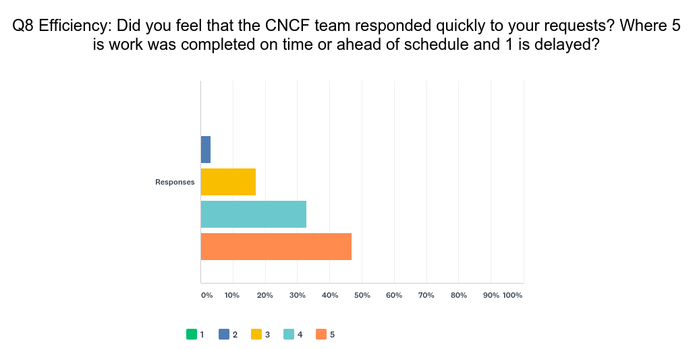
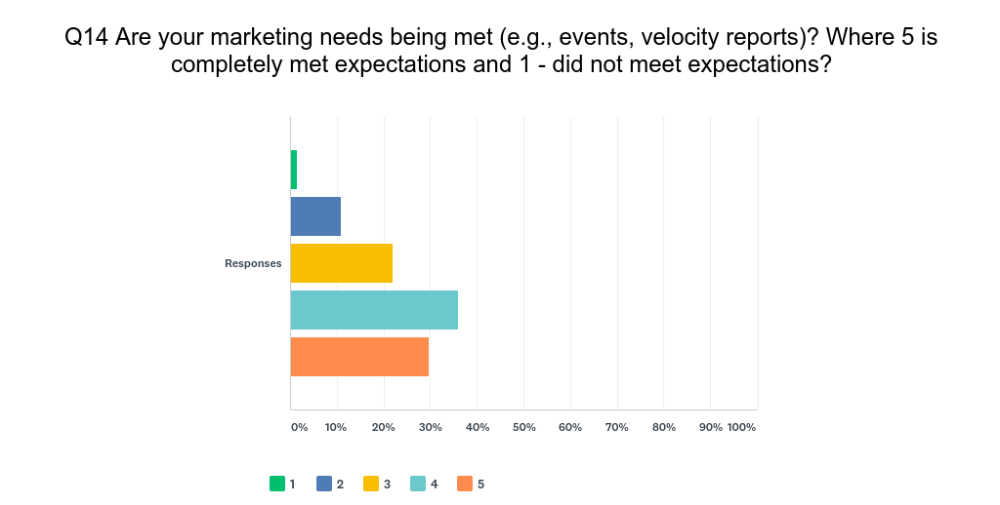
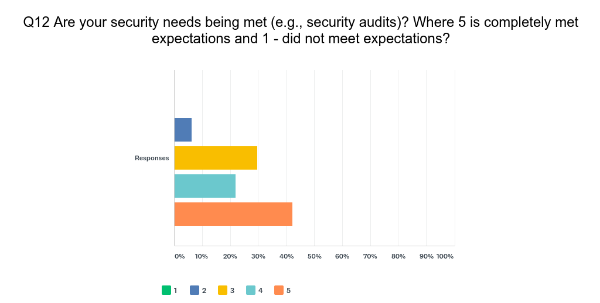
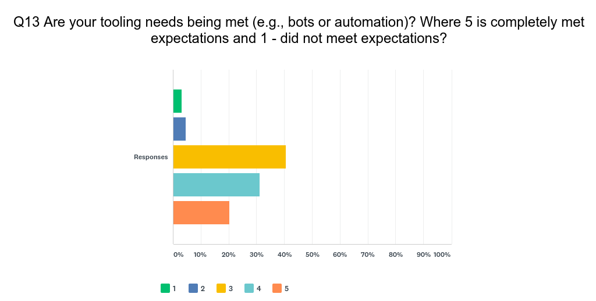
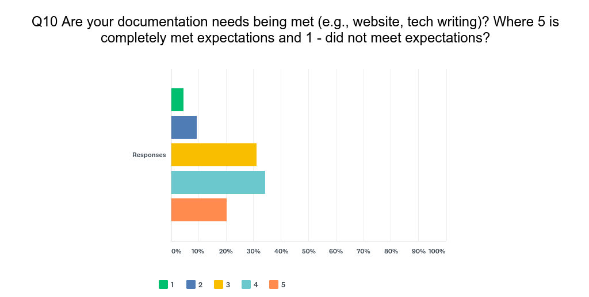
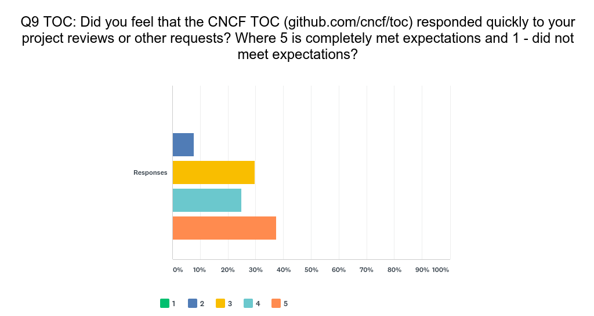
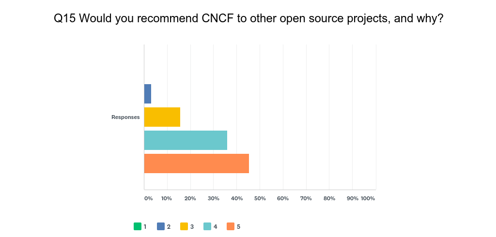
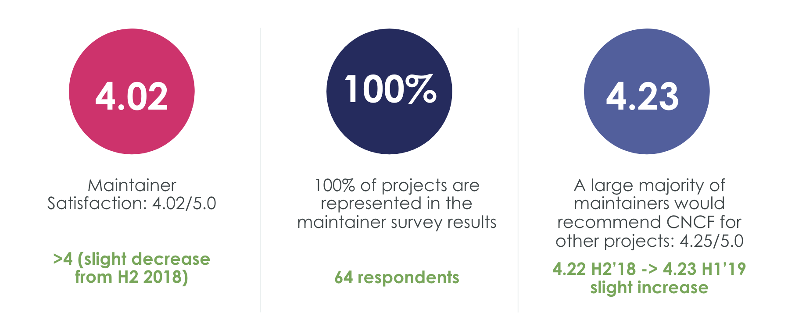

# CNCF Maintainer Survey Results 2019

## 2019 H2 Maintainer Survey Results

TODO

## 2019 H1 Maintainer Survey Results
###  Maintainer Expectations

### Collaboration

###  Efficiency

###  Marketing

###  Security

### Project Maintaining

### Tooling
_

### Documentation

### Expectations

### TOC

### Recommend

See the [data](maintainer-survey-results-2019-h1.csv) and [summary](https://docs.google.com/presentation/d/1skLZnV4mBwSVnGXUwVVDgno8F9FPUcwfi_981tS8GZY/edit#slide=id.g44dbd86c82_0_338).
