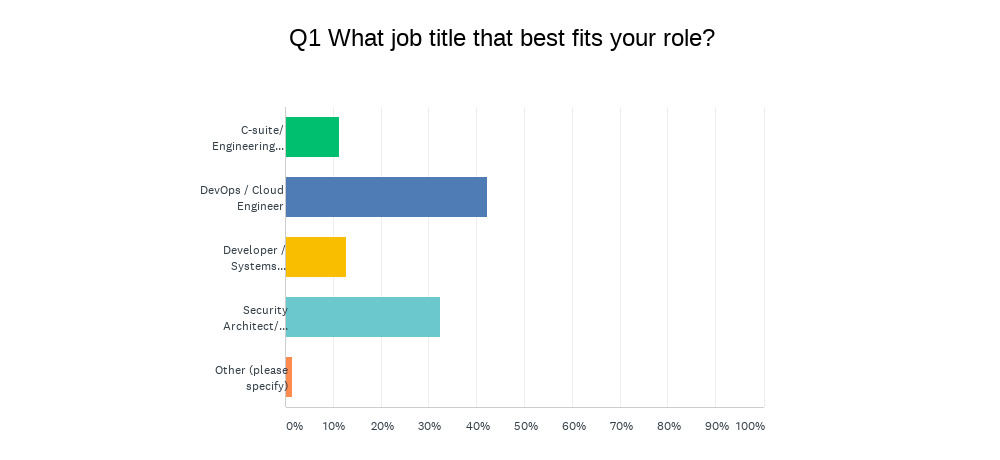
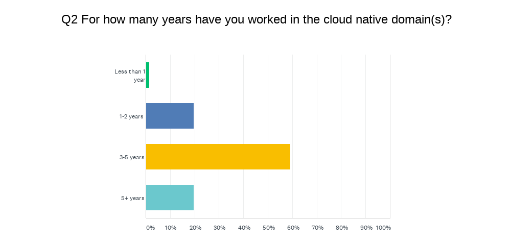
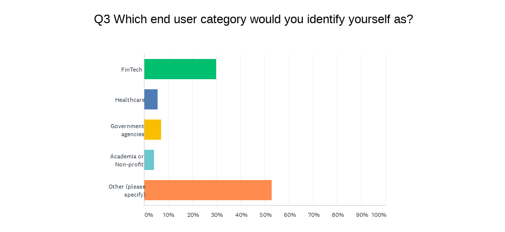
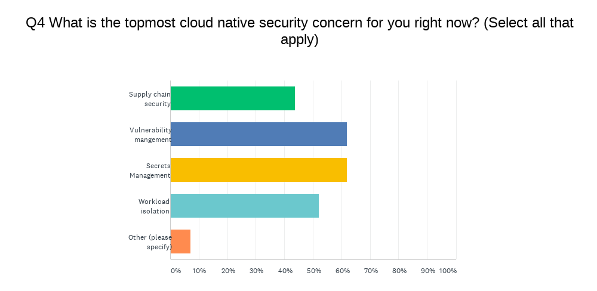
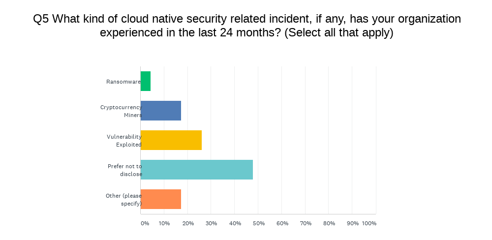
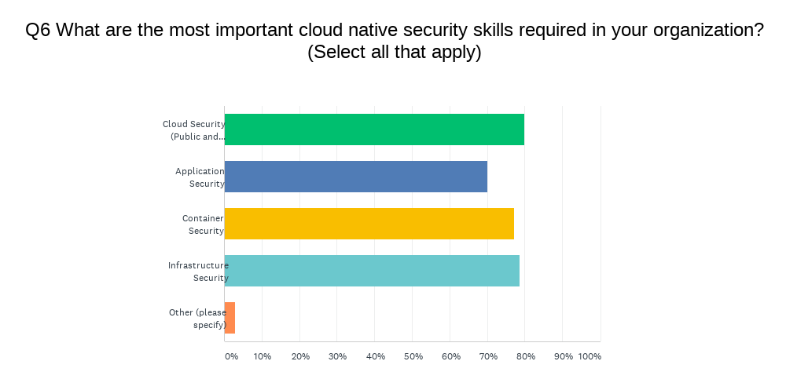
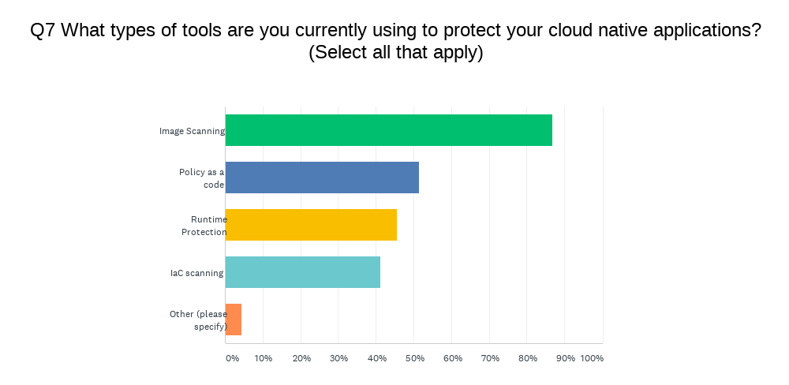
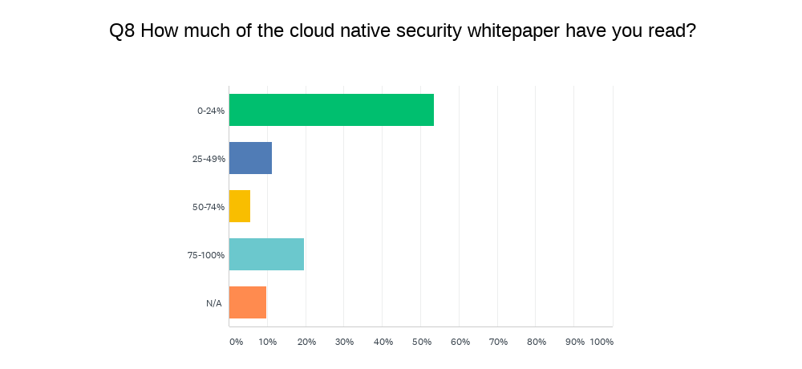
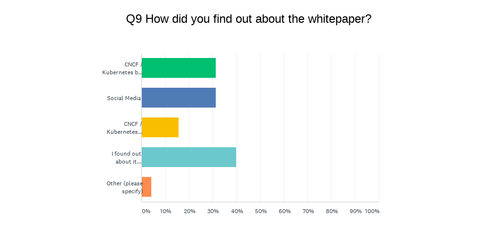
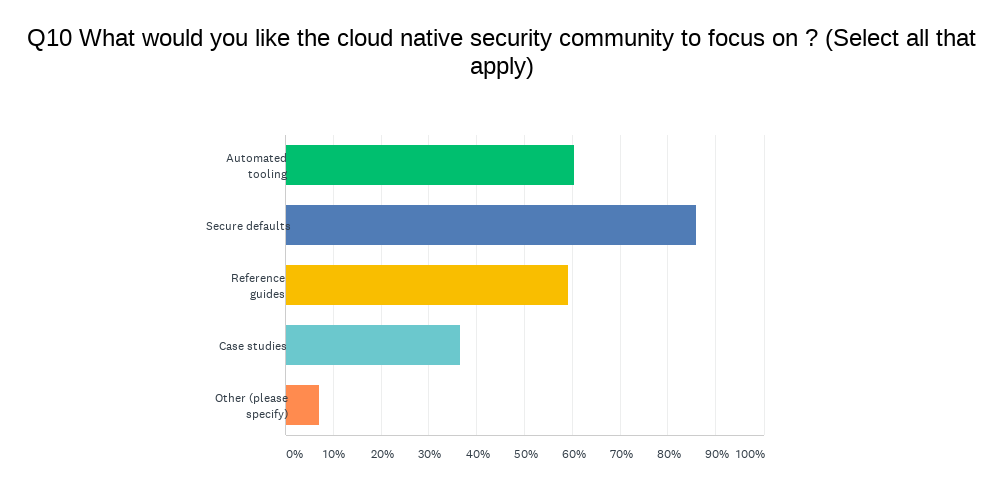

# Background

Retrospective on Cloud native security whitepaper:
https://github.com/cncf/tag-security/issues/480

## Summary

- Participants were diverse in terms of roles and years of experience, with vast
  majority DevOps and Security Architects and large majority had more than 3
  years of experience
- 53% participants identified themselves as "Other" with Telco, Tech, Privacy,
  Insurance being some notable mentions
- Inspite or maybe because of the recent focus on supply chain security,
  participants noted vulnerability management and secrets management as the top
  two cloud native security related concerns
- 47% participants preferred not to disclose security related incidents, with
  top two being vulnerabilities exploited or cryptocurrency miners.
  Interestingly, only 4% of participants noted that they were witness to a
  ransomware attack
- There was no clear consensus on which specific cloud native security skillset
  was required more than others, with all the options getting close to equal
  number of responses
- 86% of participants claimed to use image scanning, whereas Policy as a code,
  Runtime Protection and IaC scanning found equal to or less than 50% usage
- 55% participants read 0-24% of whitepaper, while 19% participants read 75-100%
  of the whitepaper
- 40% of participants did not know about the existence of the whitepaper. 31% of
  the participants found out about the whitepaper through CNCF / Kubernetes blog
  posts and social media each
- 85% of participants requested the community to focus on secure defaults, with
  60% of participants requesting to focus on automated tooling and reference
  guides each.

## Anecdotal Feedback

Although participants are happy with the work community and CNCF is doing,
Participants pointed out that kubernetes' defaults are "too open", requiring
effort and maturity to secure in production. Responses recommended that the
cloud native security community should address this in 4 ways:

1) Work on providing production ready recipes like:

+ Network policies
+ OPA Gatekeeper constraint templates

2) Push for more buttoned-up defaults like:

+ Disabling auto-mounting service account tokens
+ Enabling audit logging

3) Introduce friendlier docs on:

+ How to increase observability
+ How to use OPA Gatekeeper

4) New open source tools to:

+ Identify image vulnerabilities effortlessly
  (both at runtime and in registry)

## All results

